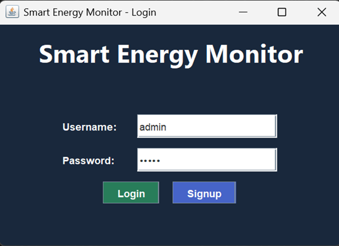
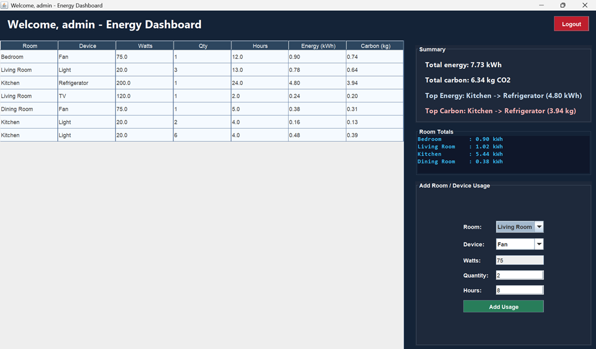

# Smart Energy Consumption Monitor

A comprehensive Java application that monitors, calculates, and predicts energy consumption across different devices and rooms. It helps track energy history, calculates carbon footprint, and provides analysis through an intuitive Dashboard interface.

## Features

- **Energy Tracking:** Store and manage usage records for multiple appliances across different rooms (powered by efficient data structures like `RoomTree` and `MaxHeap`).
- **Dashboard UI:** A graphical user interface to view live updates and system activity.
- **Carbon Footprint Calculator:** Analyzes usage records to determine the carbon emissions and environmental impact.
- **Data Analysis:** Generate usage insights using the `AnalysisService`.

---

## 📸 Screenshots

Here is the Graphical User Interface for the application:

### Interface View 1


### Interface View 2

---

## 🚀 Getting Started

### Prerequisites
- JDK 11 or higher
- IDE (IntelliJ IDEA, Eclipse, or VS Code) or Maven/Gradle (if applicable)

### Installation
1. Clone the repository:
   ```bash
   git clone https://github.com/Nehachavan03/Smart-Energy-Consumption-monitor.git
   ```
2. Navigate to the project directory:
   ```bash
   cd Smart-Energy-Consumption-monitor
   ```
3. Compile and Run the application:
   - Run `src/main/java/com/energy/monitor/Main.java` inside your IDE to start the application.

## 🛠️ Built With

- **Java** - Core programming logic and OOP design.
- **Swing / AWT Data Structures** - Used for Dashboard UI and efficient hierarchy mapping.

---
